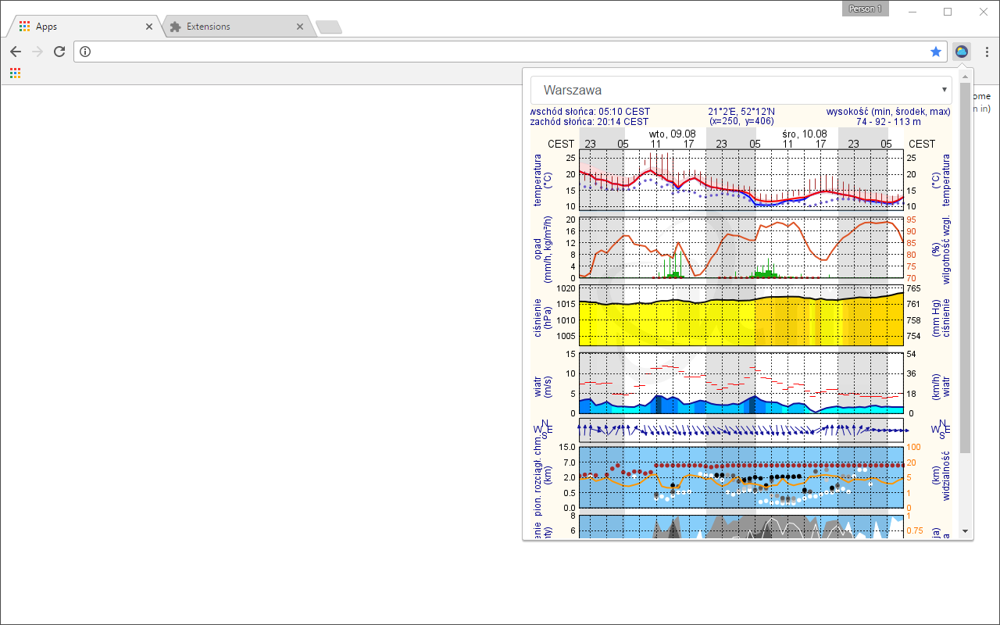

  
  <h1 align="center">Example of Google Chrome extension</h1>

"One-click Meteo" example project using simple build pipeline based on Gulp 4.

---

---

Setup:

    npm install

Build:

    npm run build